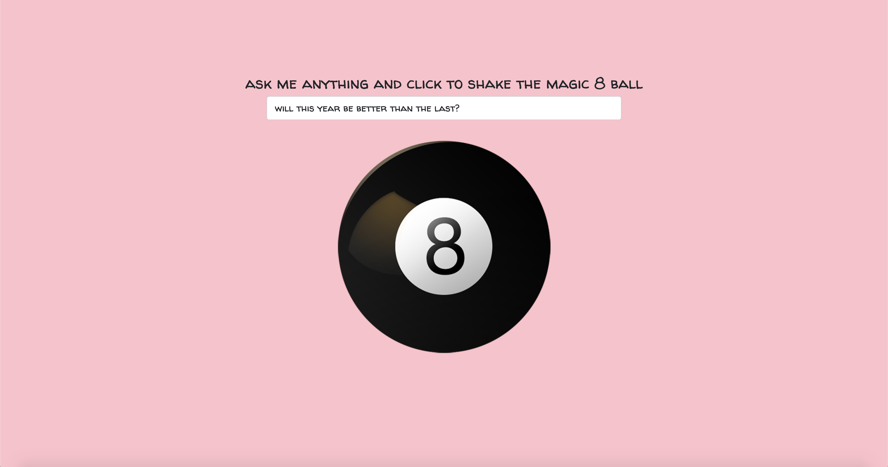
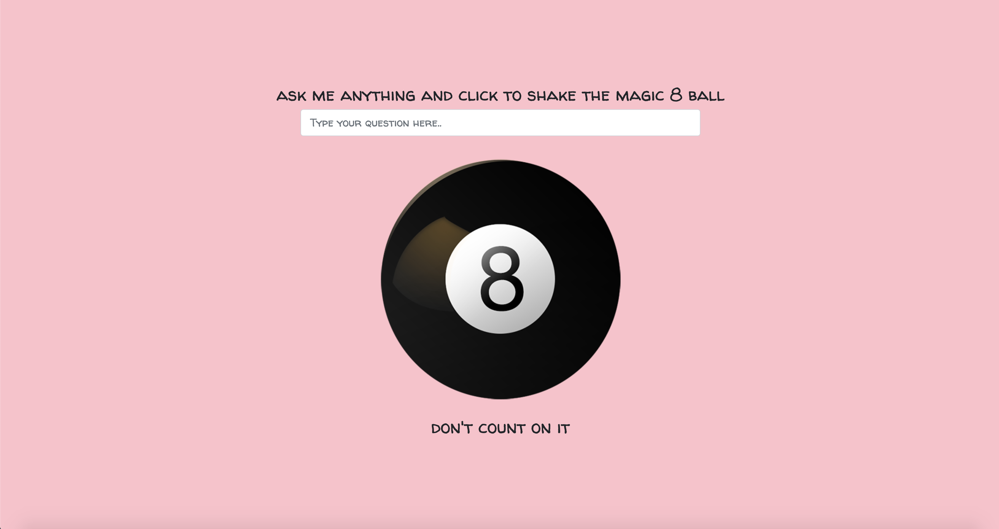

# Ask the Magic 8 Ball 

## Description 
This project is a static page application using vanilla Javascript, jQuery/DOM manipulation, CSS, and HTML. Users will be able to type in question then click the magic 8 ball to reveal in answer. If the user does not type in a question and clicks the magic 8 ball an error will appear. 

## Table of Contents
* [Installation](#installation)
* [Usage](#usage)
* [License](#license)
* [Contributing](#contributing)
* [Tests](#tests)
* [Questions](#questions)

## Installation 
No installation required. 

## Usage 
This application will allow users to ask the magic 8 ball a question and get an answer. 
Please view deployed application on [Git Hub Pages](https://nicolewallace09.github.io/askthemagic8ball/) 

## License 
This project is license under MIT

## Contributing 
No contributors. 

## Tests
There are no tests for this application. 

## Questions
If you have any questions about this projects, please contact me directly at nicole.elisaw@gmail.com. You can view more of my projects at https://github.com/nicolewallace09.
